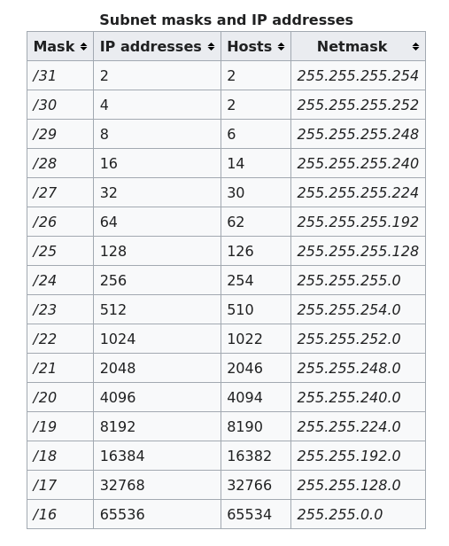

# Subnetting and CIDR

**Posted on May 10, 2023**

# Subnetting and CIDR

In network architecture, two fundamental concepts stand as pillars of efficient network design: subnetting and CIDR (Classless Inter-Domain Routing). These mechanisms form the backbone of modern network segmentation, enabling organizations to architect their digital infrastructure with precision and elegance.

## The Essence of Subnetting

Each subnet operates as its own microcosm, with unique addressing and defined boundaries, yet remains seamlessly integrated into the greater network ecosystem.

## The Refinement of CIDR

CIDR represents the evolution of network addressing, introducing a level of sophistication that transcends traditional classification methods. Through its elegant notation system, CIDR enables precise control over network segmentation, allowing for the efficient allocation of address spaces with remarkable granularity.

## Math of Network Design

```latex
Number of Possible Subnets = 2^{number of subnet bits}
Number of Hosts per Subnet = 2^{number of host bits} - 2
```

 \
*image from
[Wiki](https://en.wikipedia.org/w/resources/src/jquery.tablesorter.styles/images/sort_both.svg?0e440)*

Using a network address of 192.168.1.0/24. The "/24" notation explains that 24 bits are dedicated to the network portion, leaving 8 bits for host addressing. This arrangement yields 254 possible host addresses—a numerical dance of binary possibilities, with the first and last addresses reserved for network and broadcast functions respectively.

> "In the art of network design, subnetting and CIDR work in concert to create a harmonious balance between efficiency and functionality, much like the interplay of form and function in classical architecture."

**If there is need for adjustment and Corrections feel free to send me a mail tifelabs[at]gmail[dot]com*

Thanks
