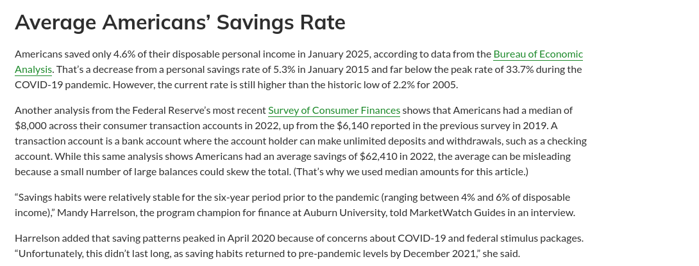
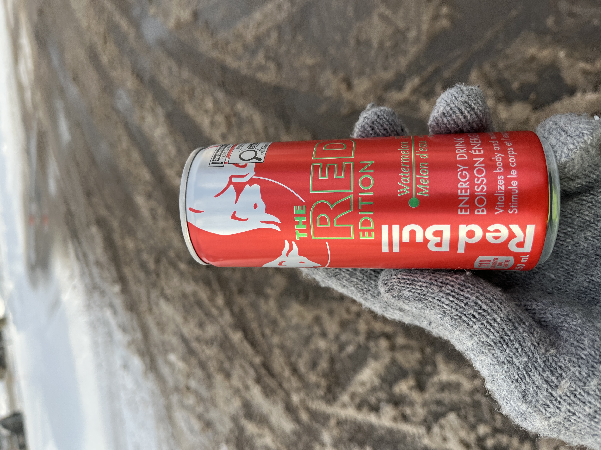
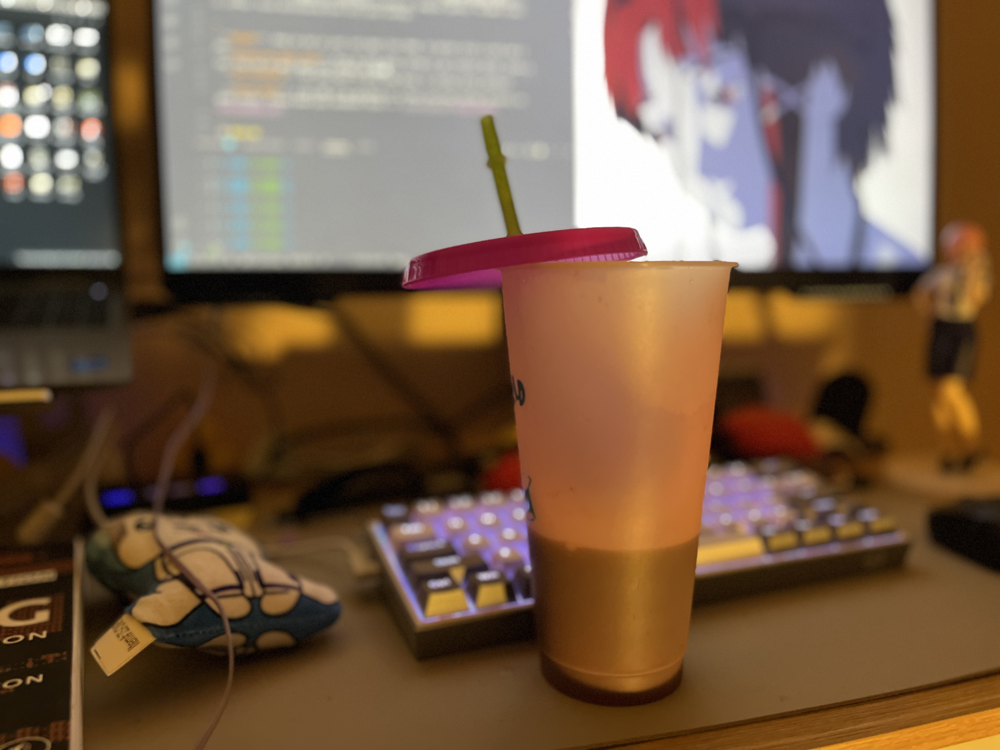
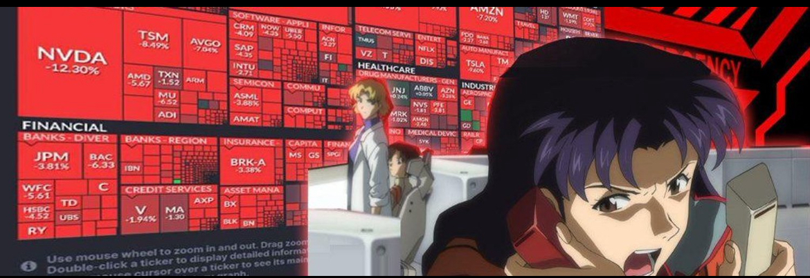

# The Milestone

**Posted on June 4, 2025**

> *"Happiness ain’t just havin’ money. It’s ‘bout the joy of hittin’ goals and workin’ hard." – Franklin D. Roosevelt*

I used to think life would be super easy if I had tons of money. Like, a new iPhone, a dope JDM car, a nice apartment, or a trip to Japan. But I’m in my early twenties, and I learned money isn't the answer. It’s about being smart with it and not drownin’ in debt that messes you up later.

Savin’ cash is tough. Especially when you’re makin’ minimum wage or livin’ alone. You gotta say no to fun stuff sometimes, like goin’ out or grabbin’ the latest gadget. But when you save, It's feels good.

## The Milestone

- **No Debt**: Payin’ off credit cards or loans is huge.As For me, it was my student loan. It was a rough and tough time, but clearin’ it felt like a fresh start.
- **$1,000 Saved**: This is your emergency stash. Covers stuff like a car fix or random bills.
- **$10,000**: I hit this not long ago, but had to use it all for my student loan. Worth it for the clean state, tho!
- **$25,000**
- **$50,000**: If you hit this, you’re doin’ better than most people your age. It’s all ‘bout discipline.

[Chart](https://www.marketwatch.com/guides/banking/average-savings-account-balance/)
- **$100,000**: This is where compounding happens.

## Small Spendin

Alot of micro-transactions due eat up the savings, (**I'm guilty of this**) , spending cash on little things. Like a Starbucks coffee every mornin’ or a Red Bull from the gas station (Based on calcultions I found out I spend $500 a year on energy drinks!). Streamin’ services, snacks, all that jazz—it adds up. Imagine spendin’ $3,000 a year on coffee! Those microtransactions kill your savings.

- **Budgets**: Keep an eye on your cash.Apps like YNAB. Or better still a notebook and a pen.
- **Skiping the Small Stuff**: Pass on the daily coffee or gas station drink. Saves a ton. You can as well make your coffee at home... and maybe limit buying from the gas-station once per month, Best bet,just buy from walmart or better store.
Gas Stations and Convience stores are so espensive

| RedBull    | My Home-made coffee  |
|---------|---------|
|  |  |

- **Save Automatic**: Set your bank to move some money to savings every paycheck.
Use [WealthSimple](https://www.wealthsimple.com/en-ca) If you 're in Canada, I suggest you use this.

- **Investing**: I put 20% of my paycheck in a TFSA (Tax-Free Savings Account) and some good stocks and ETFS(**VFV and XEQT For Canada and VOO for the US**). Please make your research first >>> [Investopedia](https://www.investopedia.com).

If want to take risk, maybe crypto.. But I don't reccommed Options Trading,
**Don't Do Options! Don't Do Options!  Don't Do Options!**

Also check out this >>> [Personal Finance](https://near.blog/personal-finance-tips/) : Near[dot]blog

*any ideas , feedback or corrections ? Feel free to leave a mail tifelabs[at]gmail[dot]com.*
