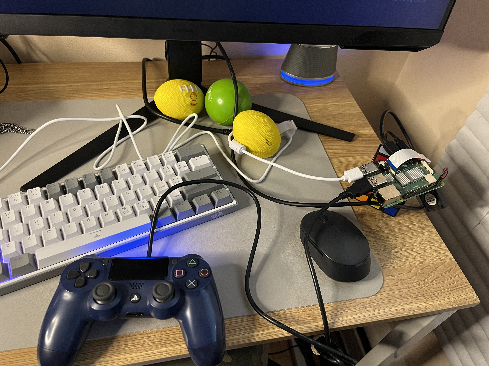

# Things I Use

**Posted on December 20, 2024**

Things I use [-- HARDWARE AND SOFTWARE --]

#### Laptop

- Dell Latitude 5520
- Lenovo IdeaPad B590 (the screen is broken). I just use it headlessly with a cheap monitor I got from a pawn shop to play kino PS2 games.

#### Camera

- Canon 4000D

```plaintext
Lens
├── Standard_Zoom
│   └── Canon_EFS_18-55mm
├── Telephoto_Zoom
│   └── Canon_Ultrasonic_75-300mm
├── Telephoto_Converter
│   └── Telephoto_HD_2.2x_AF_55mm
└── Wide_Angle_Converter
    └── HD_0.43x_AF_Wide_Angle_55mm
```

| Side    | Front   |
|---------|---------|
|  |  |

#### Peripherals

- Monitor [Samsung Odyssey G5 27"](https://www.samsung.com/ca/monitors/gaming/odyssey-g5-g55c-27-inch-165hz-curved-qhd-ls27cg550enxza/)
- KeyBoard [RedDragon K617](https://www.redragonzone.com/products/redragon-k617-fizz)
- Earpiece/HeadPhone - Some wired earphone I got a walmart.
- Mouse - **Walmart wireless mouse**

#### Editor

- [VSCode](https://code.visualstudio.com/)
- [Vim](https://www.vim.org/) Quick File (mostly **.config* files) Edit and for ssh
- [Sublime Text](https://www.sublimetext.com/) For Reading code

#### Search Engine

- [Yandex](https://yandex.com/)
- [DuckDuckGo](https://duckduckgo.com/) - It became retarded sometime ago

#### Browser

- [Brave](https://brave.com/download/)
- Firefox (due to some recent happenings with privacy. I'll give it 50% trust)

#### Websites

- [NameCheap](https://www.namecheap.com/)
- [PorkBun](https://porkbun.com/)

#### Entertainment

- PSvita
- PSP
- PS4
- Rubix Cube (3 x 3)
- Grass (yeah!! real grass, turn off your sceen and touch **mother earth**)

#### Productivity

- Terminal [Kitty](https://github.com/kovidgoyal/kitty)
- File Manager [Ranger](https://github.com/ranger/ranger)
- Shell [Zsh](https://ohmyz.sh/)
- Notes (Apple Notes).
- Pen and Paper (Cheap asf, you can get them at the dollarstore)
- FTP Client [FilleZilla](https://filezilla-project.org/)

#### Finance

- [WealthSimple](https://www.wealthsimple.com/en-ca) If you 're in Canada, I suggest you use this.

#### Misc

- [Raspberry Pi4](https://www.raspberrypi.com/products/raspberry-pi-4-model-b/)


| Retro-Pie    | Display   |
|---------|---------|
|  |  |

- [Watchy](https://watchy.sqfmi.com/)
